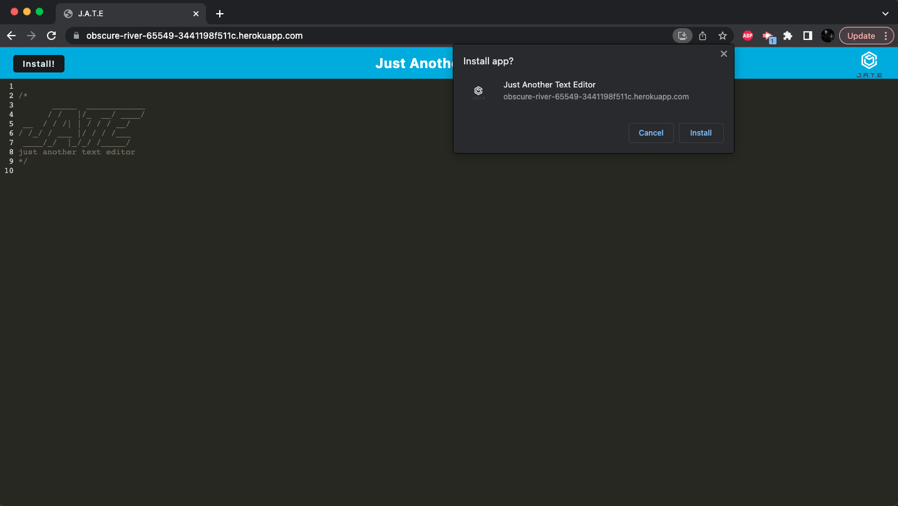
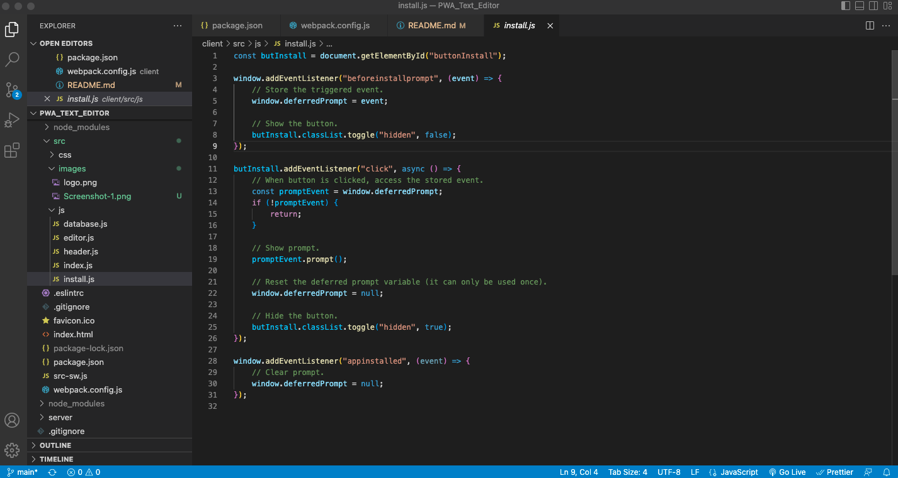
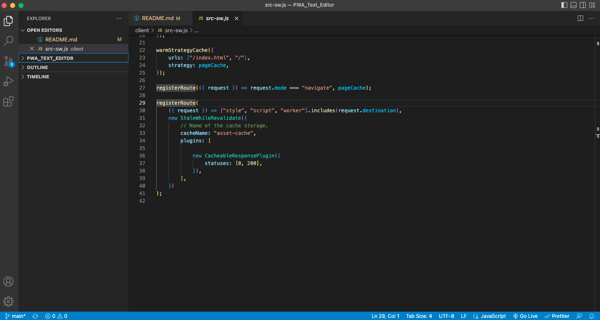

# PWA_Text_Editor

## Table of Contents

* [Description](#description)
* [Installation](#installation)
* [Usage](#usage)

## Description

This task is to build a text editor that runs in the browser. The app will be a single-page application that meets the PWA criteria. Additionally, it will feature a number of data persistence techniques that serve as redundancy in case one of the options is not supported by the browser. The application will also function offline.

### User Story

```
AS A developer
I WANT to create notes or code snippets with or without an internet connection
SO THAT I can reliably retrieve them for later use.
```


### Screenshots






### Live Application
 [hHeroku link](https://obscure-river-65549-3441198f511c.herokuapp.com/).

## Installation

run "npm i" to install the necessary dependencies.

## Usage

To use the application from the command line (after installing dependencies):
1. Open the root directory of the repository in your terminal or bash.
2. Bundle the front-end code by entering ```npm run build``` in the command line.
3. Start the server by entering ```npm run start``` in the command line.
4. Go to the port on your local host.
5. Click the "Install" button.

## License
This project is licensed under the terms of the MIT license.